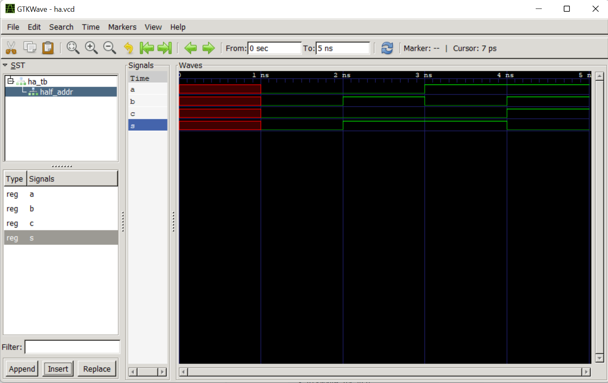
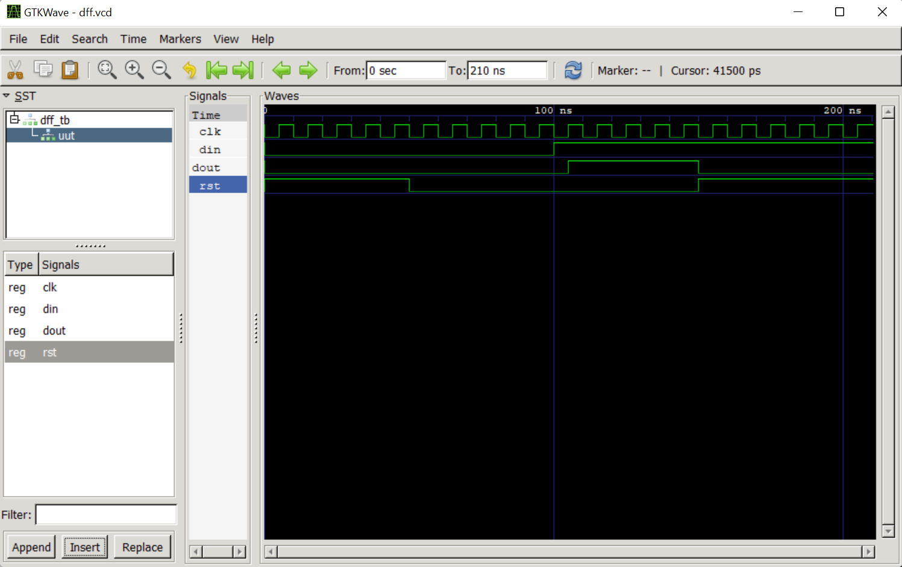

# Lab 1 -- GHDL and GTKWave

- Install GHDL and GTKWave
- Run half adder and D Flip-Flop examples
- Document Results

## Results:
### Half Adder
Run the following commands:
```
$ ghdl -a ha.vhdl
$ ghdl -a ha_tb.vhdl
$ ghdl -e ha_tb
$ ghdl -r ha_tb --vcd=ha.vcd
ha_tb.vhdl:47:5:@5ns:(assertion error): Reached end of test
$ gtkwave ha.vcd
```
Output:


### D Flip-Flop
Run the following commands:
```
$ ghdl -a dff.vhdl
$ ghdl -a dff_tb.vhdl
$ ghdl -e dff_tb
$ ghdl -r dff_tb --vcd=dff.vcd
$ gtkwave dff.vcd
```
Output:

