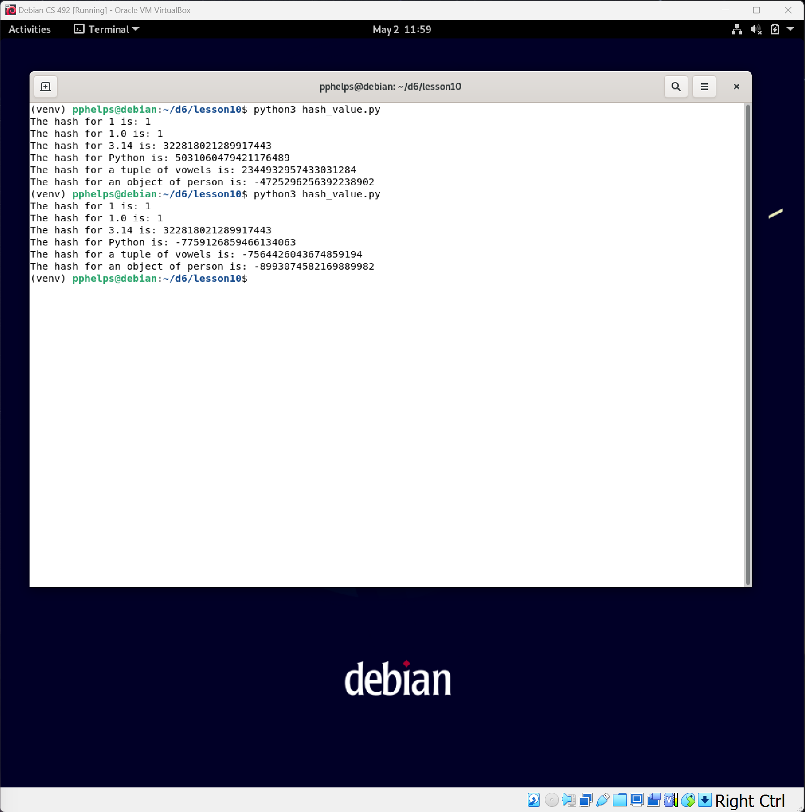
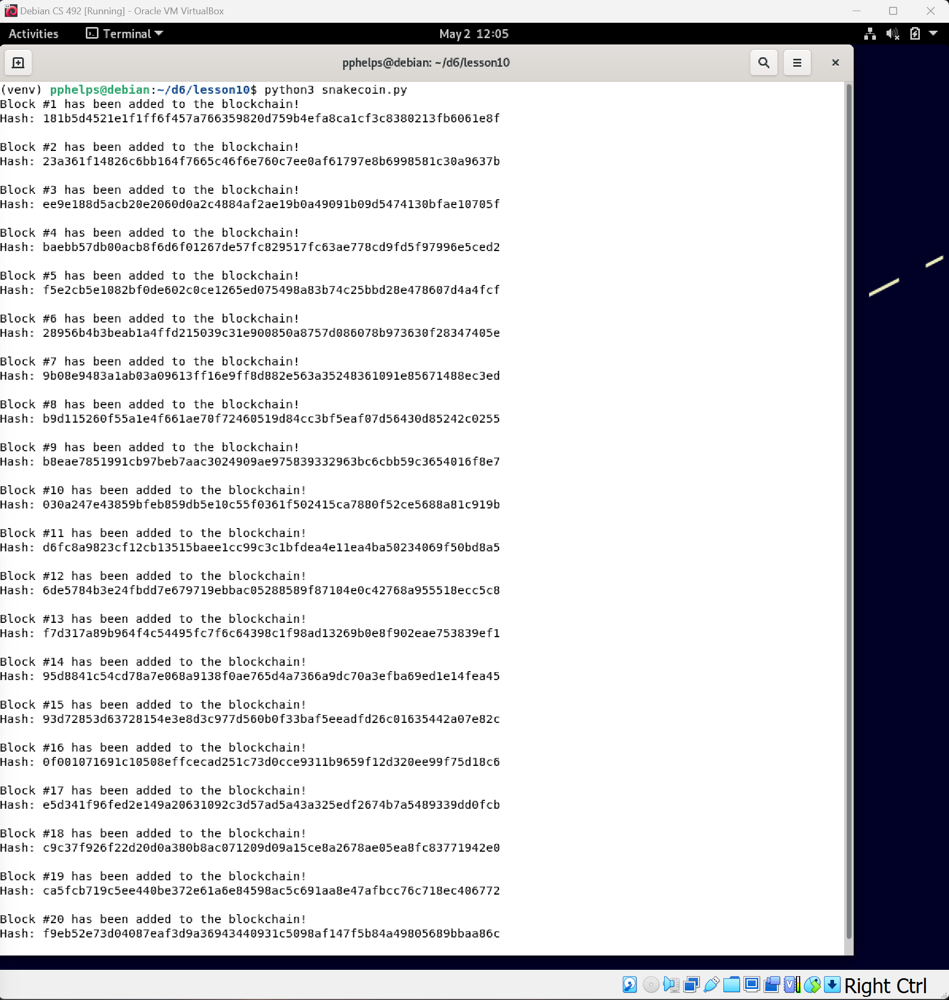
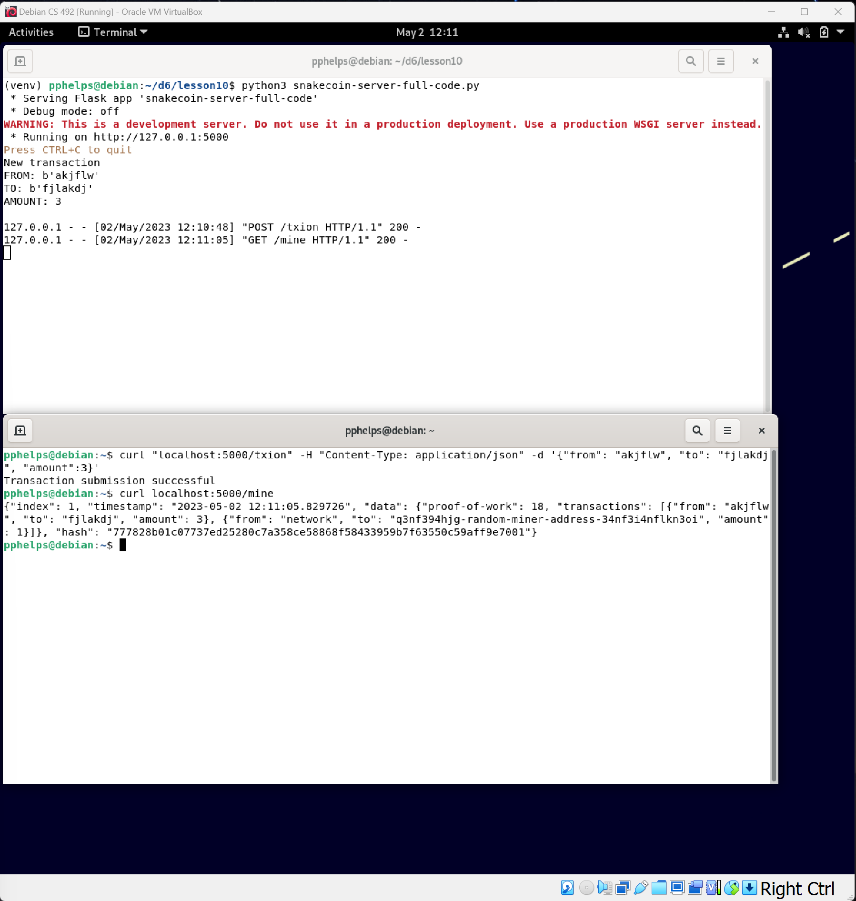
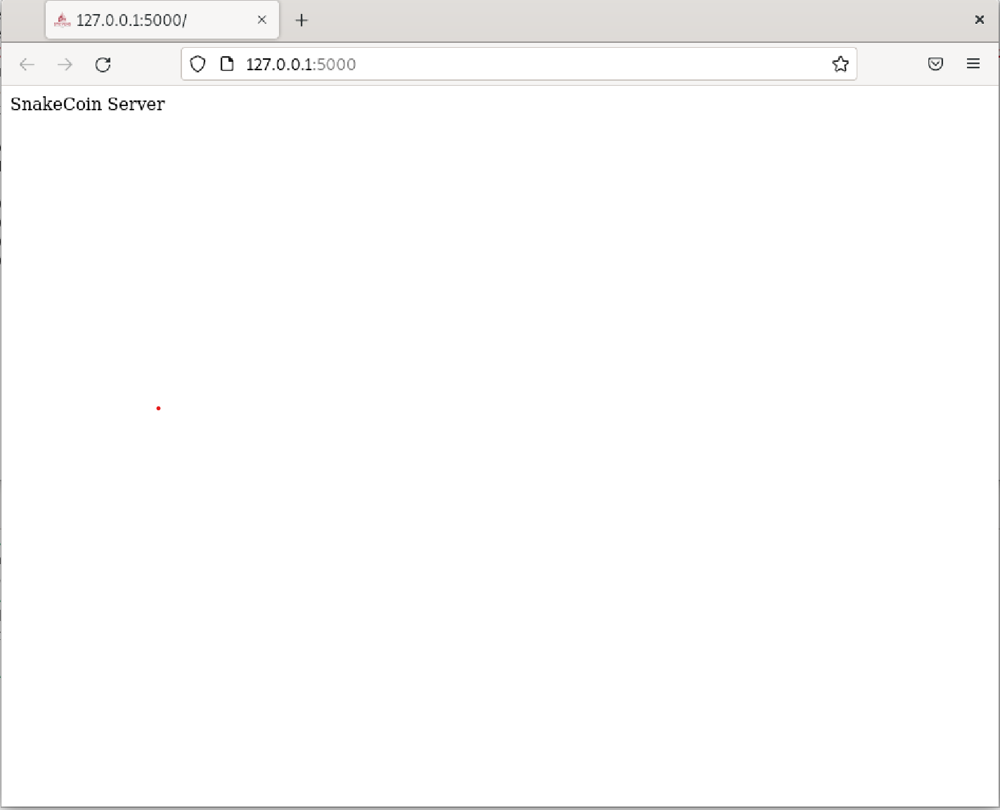
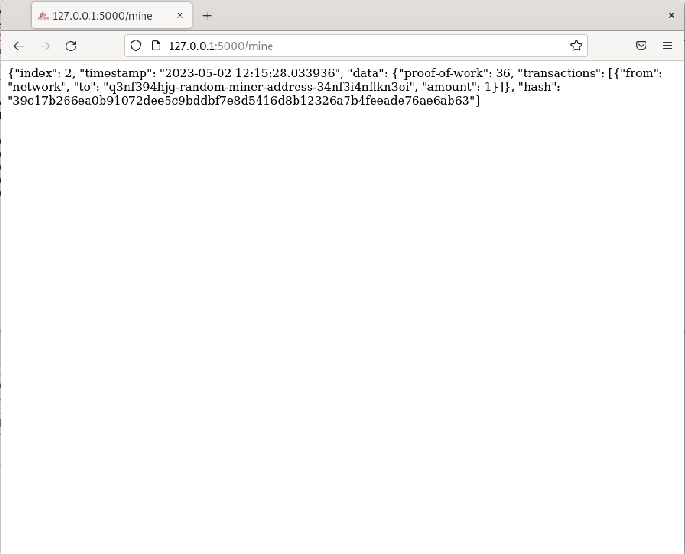
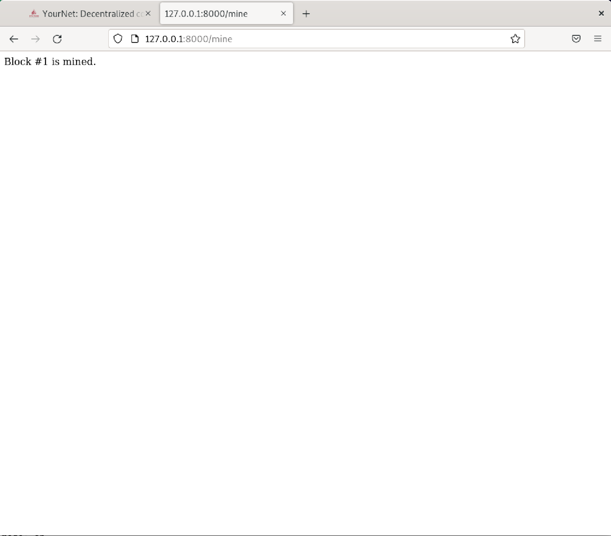
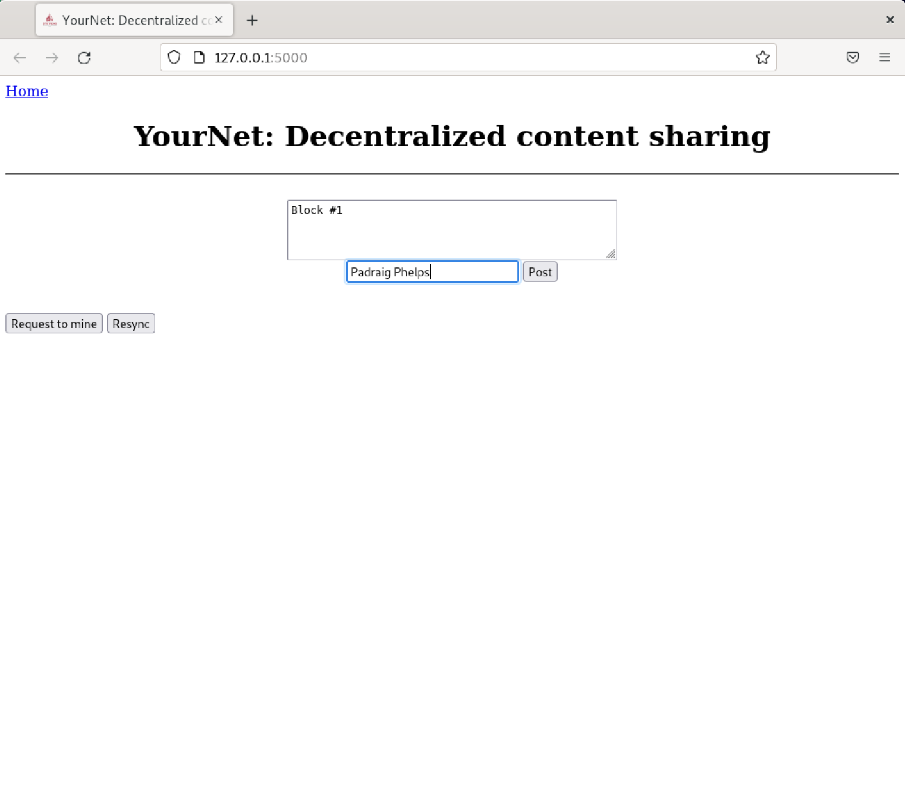

# Lab 10 -- Blockchain
### Run hash_value.py twice and compare results

### Run snakecoin.py

### Run snakecoin-server-full-code.py on Terminal 1 and mine a new block on Terminal 2

### Run node_server.py on Terminal 1 and run_app.py on Terminal 2

