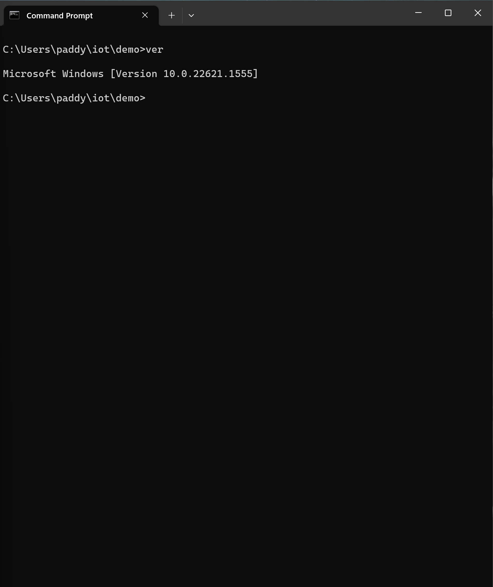

# Lab 2 -- Command Line

## Run the following

```
$ hostname
$ env
$ ps
$ pwd
$ git clone https://github.com/kevinwlu/iot.git
$ cd iot
$ ls
```


```
$ df
$ mkdir demo
$ cd demo
$ nano file
$ cat file
$ cp file file1
$ mv file file2
$ rm file2
$ clear
$ man uname
$ uname -a
$ ifconfig
$ ping localhost
$ netstat
```

