# Lab 3 -- Python
# Run the following scripts

$ python3 julian.py
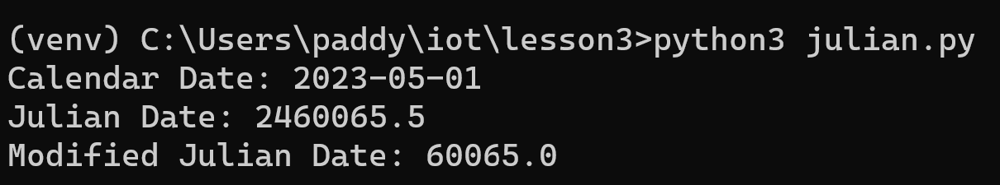

$ python3 date_example.py
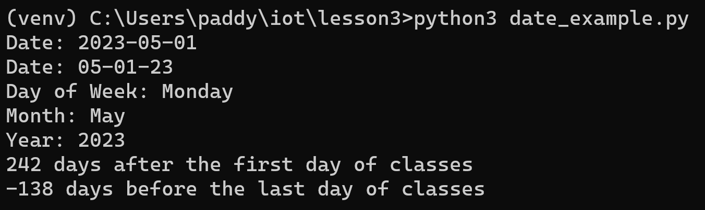

$ python3 datetime_example.py
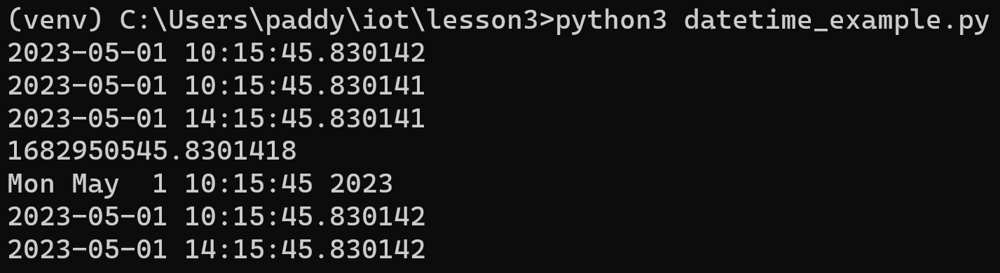

$ python3 time_example.py
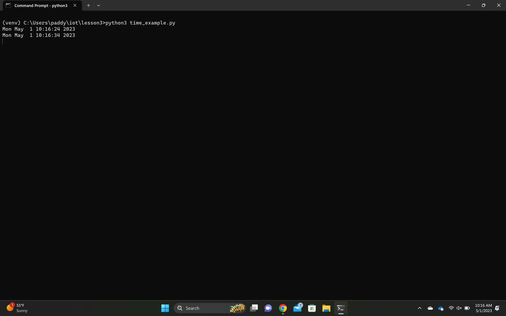

$ python3 sun.py 'New York'
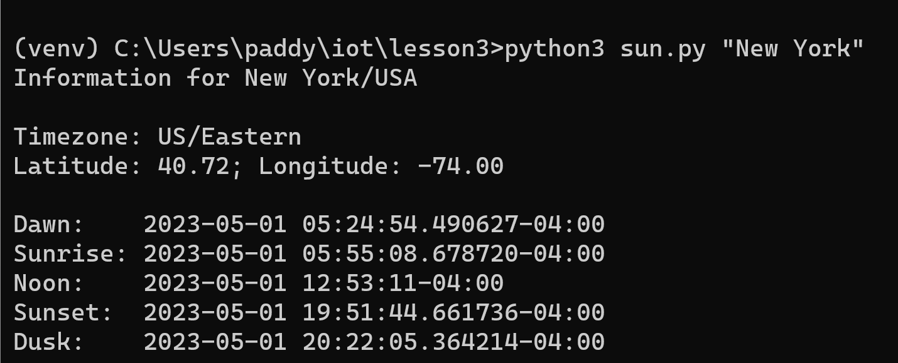

$ python3 moon.py
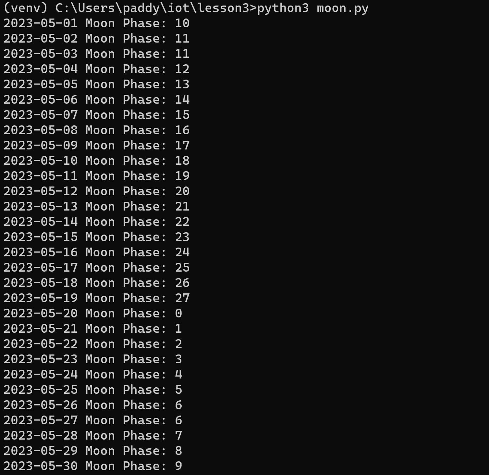

$ python3 coordinates.py 'SC Williams Library'
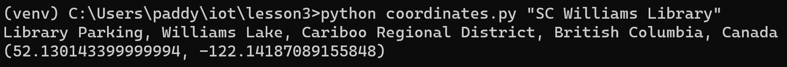

$ python3 address.py '40.74480675, -74.02532862031404'
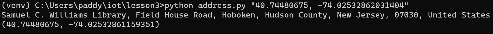

$ python3 cpu.py
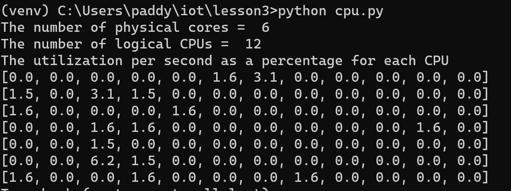

$ python3 battery.py
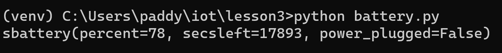

$ python3 documentstats.py document.txt
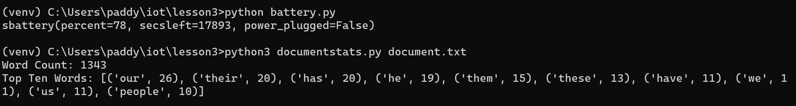
