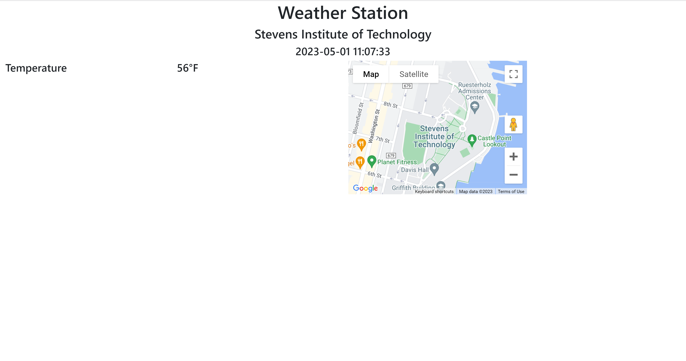
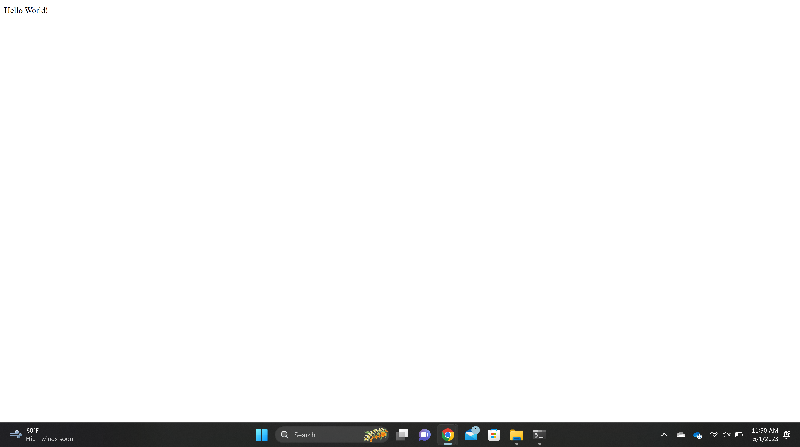

# Lab 4 -- Django and Flask
## Lab 4A and 4B
### 1. Install Django and Django REST framework
```
$ sudo pip3 install -U setuptools
$ sudo pip3 install -U django
$ sudo pip3 install -U djangorestframework
$ sudo pip3 install -U django-filter
$ sudo pip3 install -U markdown
$ sudo pip3 install -U requests
```
### 2. (Optional) Enable Database
Skipped on Windows

### 3. Start Django project "stevens"


## Lab 4C
### 1. Install Flask and Run server via hello_world.py

