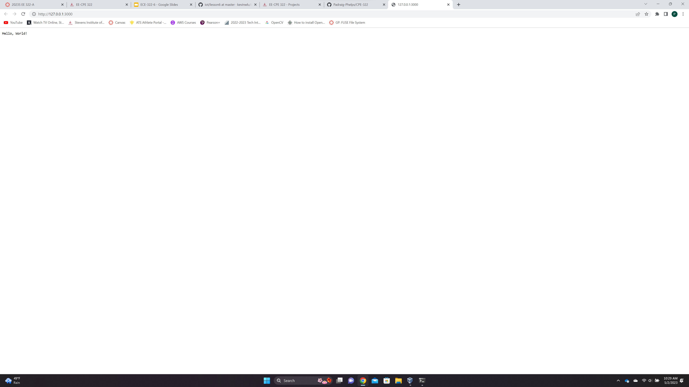
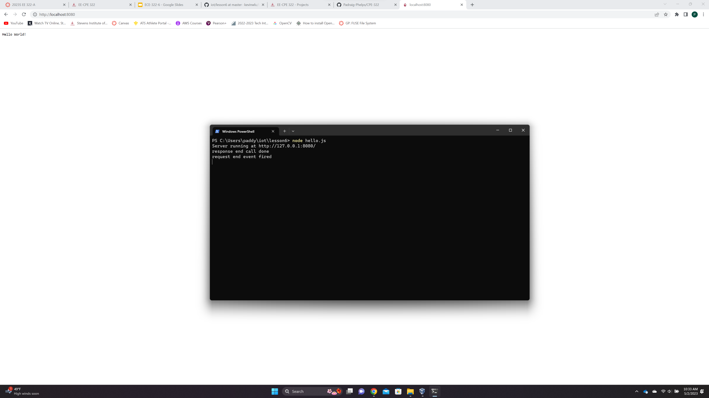
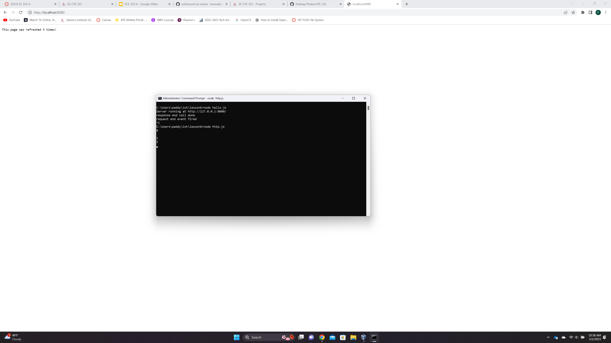
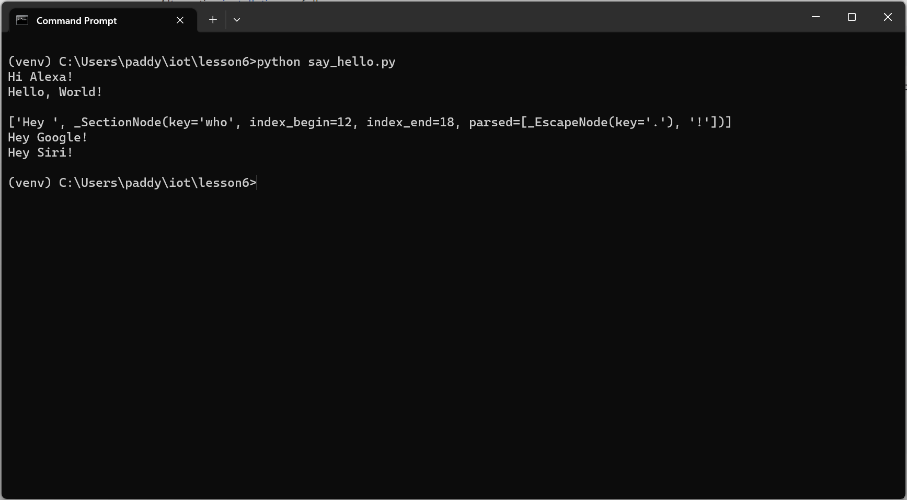

# Lab 6 -- Node.js and Pystache
## Lab 6A -- Node.js
### Download Node.js with LTS and npm
- I had previously installed node

### Run hello-world.js, hello.js, and http.js

### hello-world.js

### hello.js

### http.js

## Lab 6B -- Pystache
### Install Pystache and run say_hello.py

