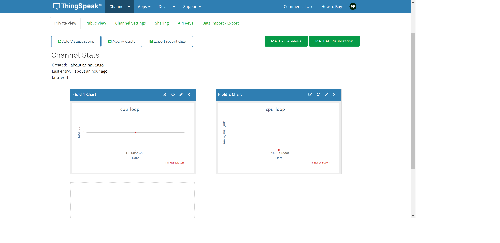
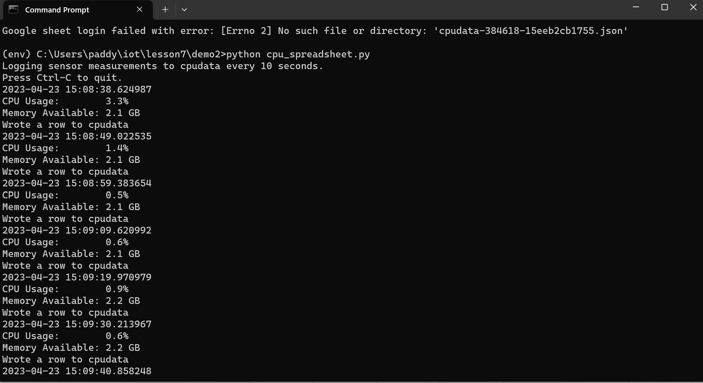
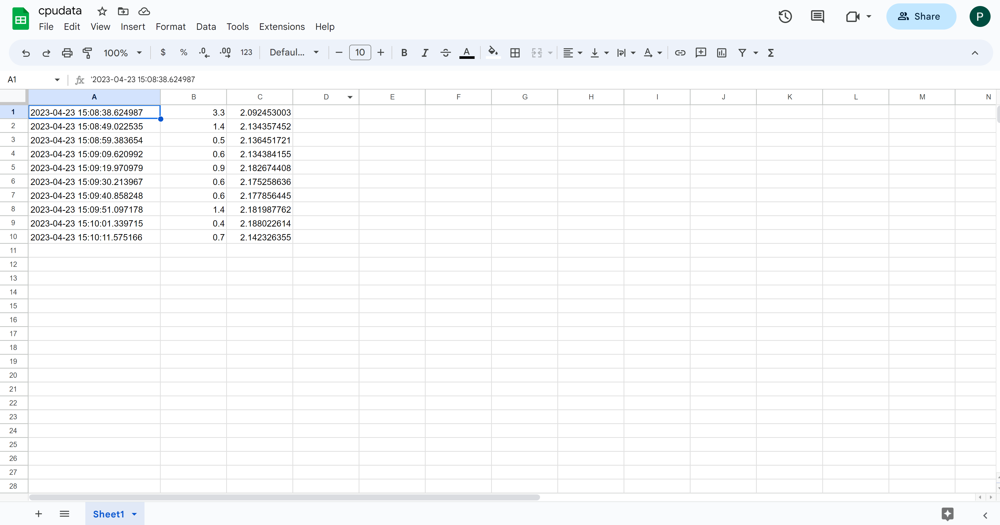

# Lab 7 -- ThingSpeak and Google Sheets

## Lab 7A: ThingSpeak

- Sign up and log in ThingSpeak
- Create new channel cpu_loop with field1 cpu_pc and field2 mem_avail_mb
- Copy the Write API Key from channels
- ThingSpeak licensing FAQ (frequently asked questions)
- Review and Run thingspeak_feed.py
- Replace the API Key

 
 ## Lab 7B: Google Sheets
 
 - Sign up and log in the Google Cloud Platform Identity and Access Management (IAM)
 - Install gspread and oauth2client
 - Copy system_info.py and rpi_spreadsheet.py to ~/demo
 - Move json key to same directory
 - Edit rpi_spreadsheet.py
 - Run rpi_spreadsheet.py
 
 
